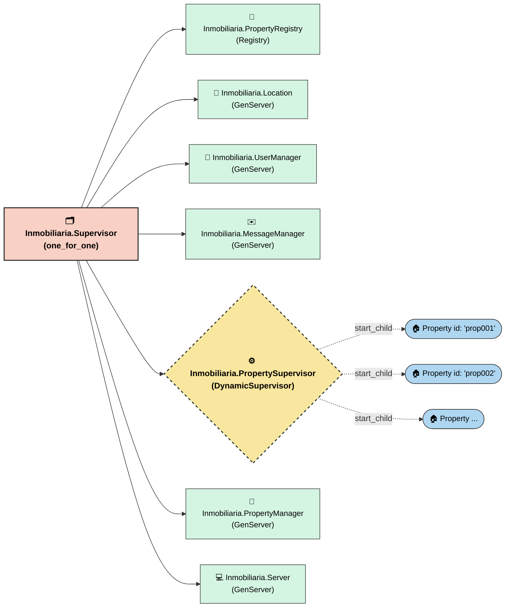
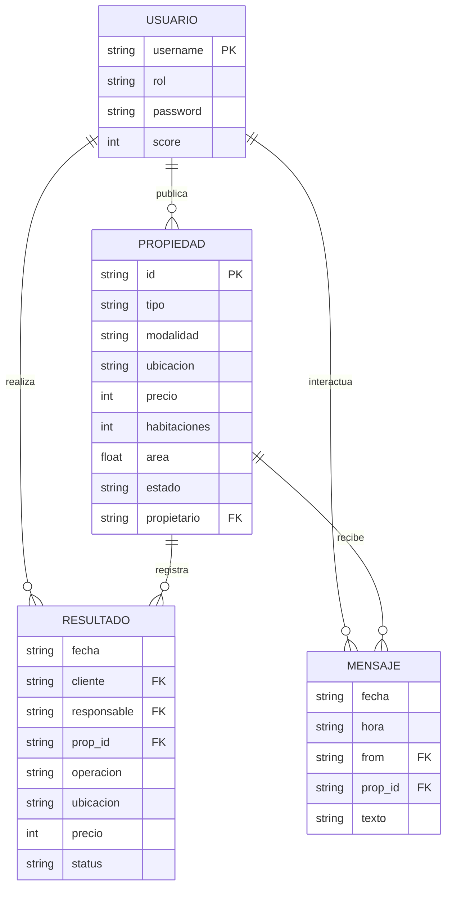
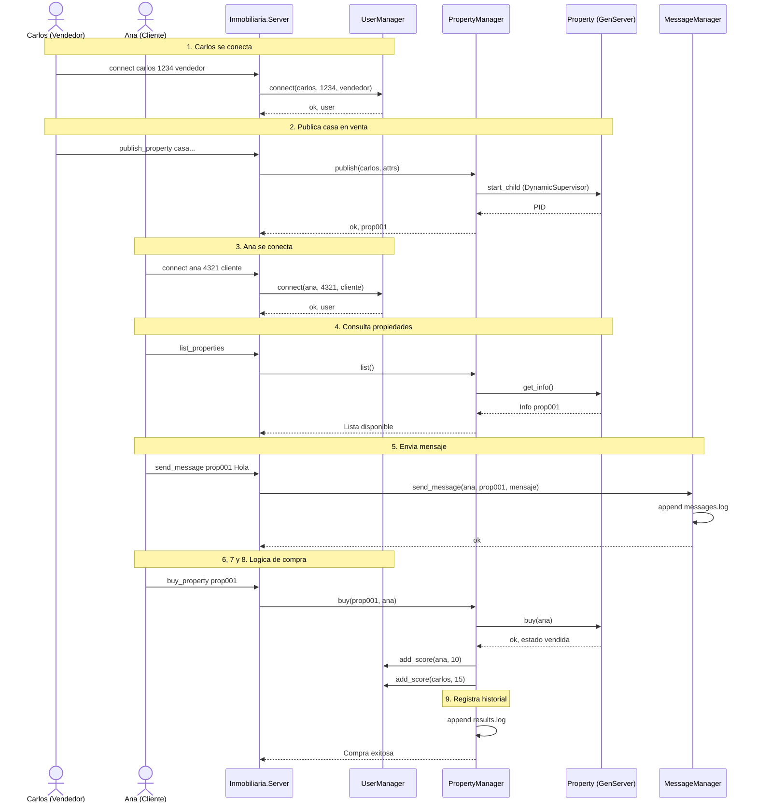

```mermaid
graph LR
    %% Supervisor Principal
    Root["🗂️ Inmobiliaria.Supervisor<br>(one_for_one)"]

    %% Procesos Hijos Directos
    Reg["📖 Inmobiliaria.PropertyRegistry<br>(Registry)"]
    Loc["📍 Inmobiliaria.Location<br>(GenServer)"]
    Usr["👤 Inmobiliaria.UserManager<br>(GenServer)"]
    Msg["✉️ Inmobiliaria.MessageManager<br>(GenServer)"]
    PropSup{"⚙️ Inmobiliaria.PropertySupervisor<br>(DynamicSupervisor)"}
    PropMgr["🏢 Inmobiliaria.PropertyManager<br>(GenServer)"]
    Srv["💻 Inmobiliaria.Server<br>(GenServer)"]

    %% Propiedades Dinámicas
    P1(["🏠 Property id: 'prop001'"])
    P2(["🏠 Property id: 'prop002'"])
    PN(["🏠 Property ..."])

    %% Conexiones del Supervisor Principal a sus hijos
    Root --> Reg
    Root --> Loc
    Root --> Usr
    Root --> Msg
    Root --> PropSup
    Root --> PropMgr
    Root --> Srv

    %% Conexiones del Supervisor Dinámico a sus procesos
    PropSup -. "start_child" .-> P1
    PropSup -. "start_child" .-> P2
    PropSup -. "start_child" .-> PN

    %% Estilos para diferenciar tipos de procesos con letras más grandes
    classDef supervisor fill:#f9d0c4,stroke:#333,stroke-width:2px,font-size:16px,font-weight:bold,color:#000;
    classDef dynSupervisor fill:#f9e79f,stroke:#333,stroke-width:2px,stroke-dasharray: 5 5,font-size:16px,font-weight:bold,color:#000;
    classDef worker fill:#d5f5e3,stroke:#333,stroke-width:1px,font-size:15px,color:#000;
    classDef dynamicWorker fill:#aed6f1,stroke:#333,stroke-width:1px,font-size:15px,color:#000;

    class Root supervisor;
    class PropSup dynSupervisor;
    class Reg,Loc,Usr,Msg,PropMgr,Srv worker;
    class P1,P2,PN dynamicWorker;
```

### 1.6 Modelo de datos

```mermaid
erDiagram
    USUARIO ||--o{ PROPIEDAD : publica
    USUARIO ||--o{ RESULTADO : realiza
    USUARIO ||--o{ MENSAJE : interactua
    PROPIEDAD ||--o{ RESULTADO : registra
    PROPIEDAD ||--o{ MENSAJE : recibe

    USUARIO {
        string username PK
        string rol 
        string password
        int score 
    }

    PROPIEDAD {
        string id PK 
        string tipo 
        string modalidad 
        string ubicacion
        int precio
        int habitaciones
        float area
        string estado 
        string propietario FK 
    }

    RESULTADO {
        string fecha
        string cliente FK 
        string responsable FK 
        string prop_id FK 
        string operacion 
        string ubicacion
        int precio
        string status
    }

    MENSAJE {
        string fecha
        string hora
        string from FK 
        string prop_id FK 
        string texto
    }
```

### 1.7 Diagrama de Secuencia

```mermaid
sequenceDiagram
    actor Carlos as Carlos (Vendedor)
    actor Ana as Ana (Cliente)
    participant CLI as Inmobiliaria.Server
    participant UManager as UserManager
    participant PManager as PropertyManager
    participant Prop as Property (GenServer)
    participant MManager as MessageManager

    Note over Carlos, UManager: 1. Carlos se conecta
    Carlos->>CLI: connect carlos 1234 vendedor
    CLI->>UManager: connect(carlos, 1234, vendedor)
    UManager-->>CLI: ok, user
    
    Note over Carlos, Prop: 2. Publica casa en venta
    Carlos->>CLI: publish_property casa...
    CLI->>PManager: publish(carlos, attrs)
    PManager->>Prop: start_child (DynamicSupervisor)
    Prop-->>PManager: PID
    PManager-->>CLI: ok, prop001

    Note over Ana, UManager: 3. Ana se conecta
    Ana->>CLI: connect ana 4321 cliente
    CLI->>UManager: connect(ana, 4321, cliente)
    UManager-->>CLI: ok, user

    Note over Ana, Prop: 4. Consulta propiedades
    Ana->>CLI: list_properties
    CLI->>PManager: list()
    PManager->>Prop: get_info()
    Prop-->>PManager: Info prop001
    PManager-->>CLI: Lista disponible

    Note over Ana, MManager: 5. Envia mensaje
    Ana->>CLI: send_message prop001 Hola
    CLI->>MManager: send_message(ana, prop001, mensaje)
    MManager->>MManager: append messages.log
    MManager-->>CLI: ok

    Note over Ana, UManager: 6, 7 y 8. Logica de compra
    Ana->>CLI: buy_property prop001
    CLI->>PManager: buy(prop001, ana)
    PManager->>Prop: buy(ana)
    Prop-->>PManager: ok, estado vendida
    
    PManager->>UManager: add_score(ana, 10)
    PManager->>UManager: add_score(carlos, 15)
    
    Note over PManager: 9. Registra historial
    PManager->>PManager: append results.log
    PManager-->>CLI: Compra exitosa
```
