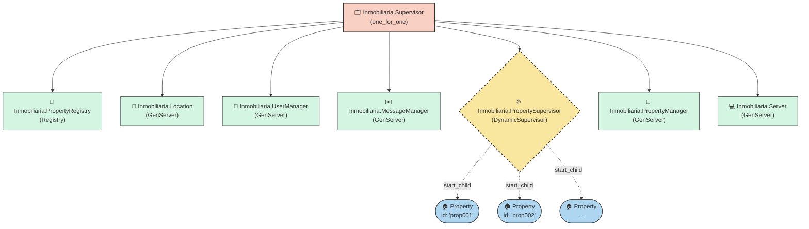

```mermaid
graph TD
    %% Supervisor Principal
    Root["🗂️ Inmobiliaria.Supervisor<br>(one_for_one)"]

    %% Procesos Hijos Directos
    Reg["📖 Inmobiliaria.PropertyRegistry<br>(Registry)"]
    Loc["📍 Inmobiliaria.Location<br>(GenServer)"]
    Usr["👤 Inmobiliaria.UserManager<br>(GenServer)"]
    Msg["✉️ Inmobiliaria.MessageManager<br>(GenServer)"]
    PropSup{"⚙️ Inmobiliaria.PropertySupervisor<br>(DynamicSupervisor)"}
    PropMgr["🏢 Inmobiliaria.PropertyManager<br>(GenServer)"]
    Srv["💻 Inmobiliaria.Server<br>(GenServer)"]

    %% Propiedades Dinámicas
    P1(["🏠 Property<br>id: 'prop001'"])
    P2(["🏠 Property<br>id: 'prop002'"])
    PN(["🏠 Property<br>..."])

    %% Conexiones del Supervisor Principal a sus hijos
    Root --> Reg
    Root --> Loc
    Root --> Usr
    Root --> Msg
    Root --> PropSup
    Root --> PropMgr
    Root --> Srv

    %% Conexiones del Supervisor Dinámico a sus procesos
    PropSup -. "start_child" .-> P1
    PropSup -. "start_child" .-> P2
    PropSup -. "start_child" .-> PN

    %% Estilos para diferenciar tipos de procesos
    classDef supervisor fill:#f9d0c4,stroke:#333,stroke-width:2px;
    classDef dynSupervisor fill:#f9e79f,stroke:#333,stroke-width:2px,stroke-dasharray: 5 5;
    classDef worker fill:#d5f5e3,stroke:#333,stroke-width:1px;
    classDef dynamicWorker fill:#aed6f1,stroke:#333,stroke-width:1px;

    class Root supervisor;
    class PropSup dynSupervisor;
    class Reg,Loc,Usr,Msg,PropMgr,Srv worker;
    class P1,P2,PN dynamicWorker;
```